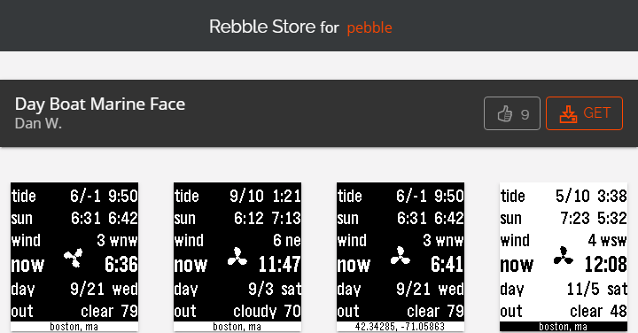

# Pebble Dayboat Marine Face
Day Boat Marine Face -- Pebble weather information clock face

Now hosted in the [Rebble Store for pebble](http://store-beta.rebble.io/app/5664e0d92369a756d700000a) (Pebble was acquired by FitBit in 2017)

## Description

Everything you need for a day out on the water.

From the NOAA or Weather Underground* and Sunrise-Sunset.org:

- current and next tide height and time
- sunrise and sunset time
- wind speed and direction
- weather forecast, current and high or low temperature
- current gps coordinates or city

Also, time and date for when the weekend's over.

Check out the Settings page for more features.

*A free API Key from http://www.wunderground.com/weather/api/ is required.

## Version Information

- Developer: Dan W.
- Category: Faces
- Updated: 2017-08-27
- Version: 2.1

